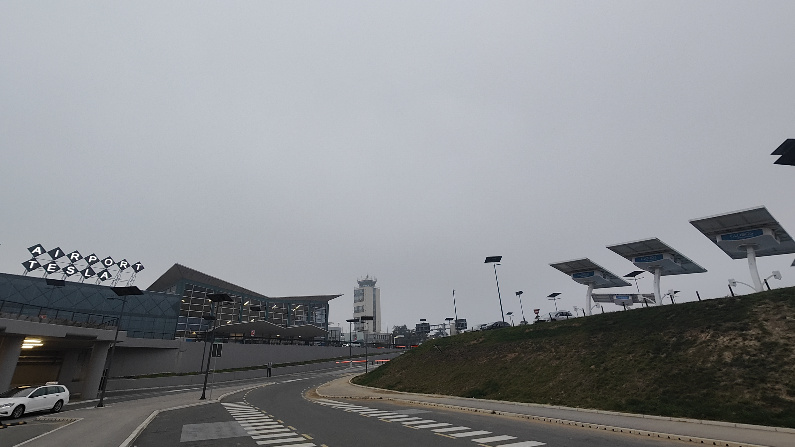
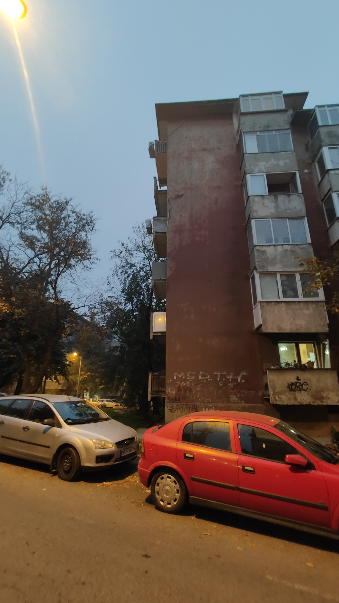
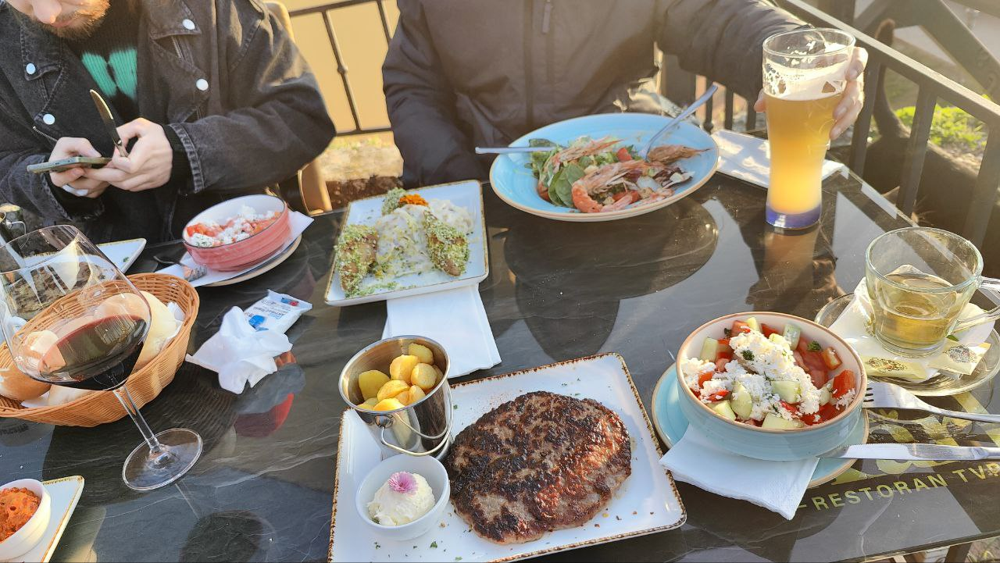
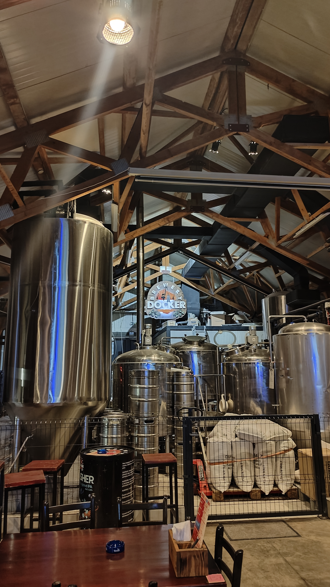
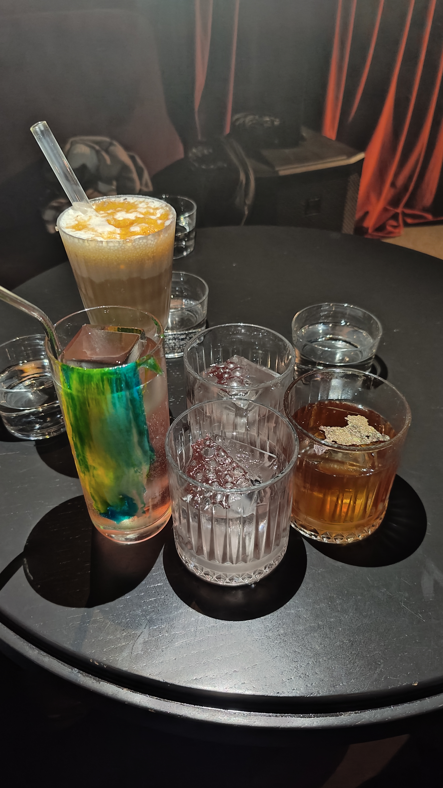
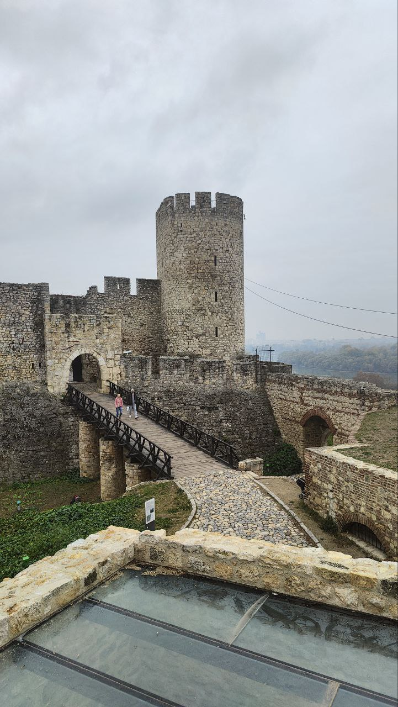
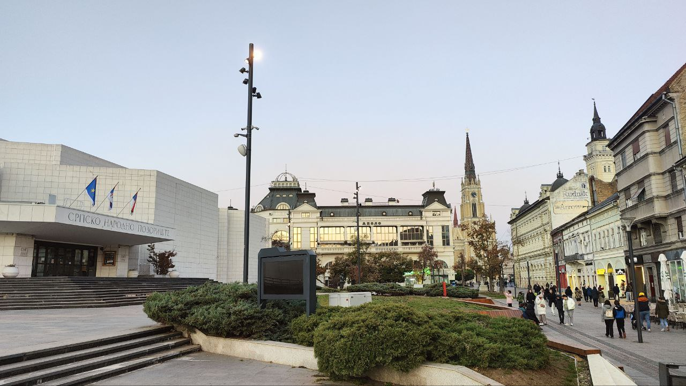

## Как добраться

- SVO ✈️ BEG 3ч

- Можно и через Турцию, но тут че важнее: потратить кучу времени на перелёт или потратить кучу бабок на прямой рейс

## Связь 

- В аэропорту покапаешь *симку* на кучу гигов за адекватный прайс и все - операторы **Yettel** / MTS

## Транспорт

- **Яндекс Такси**: расчёт в RSD, но можно с русских карт (никаких баллов плюса ждать не стоит)
- **Автобус**: заходишь, скидываешь смс (9011 - A90) и доезжаешь в центр (водилы правда жесткие)

## Атмосферка / погодка 

- **Погода может внезапно меняться**, например с +16 до +2
- Главная беда Белграда - **смог** - тоже может, как и погода, появится из неоткуда
- В целом в городе *серенько*, особенно со смогом 
- **Урбанистично**, но не супер современно, напоминает рус провинцию, *брутальненько*

## Люди

- Людей не слишком много, но и не мало, то есть толп народу нет на улице, но бывает что кафешки заняты полностью
- **Полако** - местный лайфстайл: неспешный, расслабленный образ жизни 
- **Люди любят поболтать довольно громко** (некоторым даже кажется как будто сербы вечно ругаются или угрожают)
- **Любят посидеть** в ресторанах ещё часок-другой после того как уже все съели, а возможность курнуть в рестиках способствует этому
### Язык

- *Вроде незнакомый, а вроде и знакомый*
- Много слов похожих на русские: например 300, месом, и тд 
- Много русских и много русских заведений, так что атмосфера России имеется 

## Быт
 
 - **Двери на себя** - ох как это не привычно
 - В квартирах часто стоит *бойлер*, так что душик принимать долго не получится 
 - И бывает *холодновато* (ну или только у меня так было)

## Магазы

- **По выходным магазы закрыты**, так что шопиться - по будням
- **Цены в магазинах такие же как в Москве** - так что *айфончик купить подешевле здесь не получится* 

## Еда

- **Огромные порции** - одного блюда достаточно
- В бекон заворачивают многое, например *финики!*, но в основном мясное - мясо с мясом
	- Vesalica - свинина в беконе
- **Очень много мяса**
- ПлЕскавица - огромная котлетище есть вариант в булке, есть ресторанный без булки
- Snicle/a - Шницель - есть разные виды: 
	- Pohovana = Венский = классическая отбивная в сухарях
	- Lovacke - шницель в соусе
	- Karađorđeva - шницель с каймаком внутри = аналог котлеты по киевски
	- Подаются шницели с картохой, лимончиком и соусом тар-тар
- Cevap (Чевапи) = чевапчичи - кебабчики
- Prasece pecenje - запечённая свининка 

- **Очень много хлеба**
- Бурек - промасленное слоеное тесто с начинкой: сыр/фарш/...
- Лепиња (Лепиня) - булка с начинками
- Столько мяса и хлеба надо как-то балансировать - так что распространены *йогурты* 
- Брынза не соленая, больше в *нежность*
- Популярные закуски 
- **Каймак** = масло - смазывают все подряд
- **Аджур** = перечная паста = овощная консерва - тоже частое блюдо вприкуску с хлебом 
- С салатами бедновато - в основном *шопский*, либо сербский (шопский без сыра), либо помидоры с сыром (шопский без огурцов и перца и лука)
- **Кнедлики** - булочки-пироженые из картошки размером с кулачок 
	- Тесто оч плотное, вкус картошки особо не ощущается, больше похоже на Дагестанский Хинкал -  как будто толстый кусок вареного теста 
	- Самое главное в кнедликах - начинка: классику со сливой, с топовой кислинкой; фисташковый, с нежнейшим кремом и малинкой, шоколадный с апельсином, и другие 

### Цены и атмосфера 

- И снова **курение в ресторанах не запрещено**, так что кому-то может не зайти такое, и спасение можно найти в русских заведениях, где часто запрещают курить
- **Цены на еду тоже около московские**: 900р за горячее блюдо в рестике, 300р за стритфуд
- И *в супермаркетах цены нормальные*, закупиться по дешевке можно разве что Принглсами

## Алкоголь

### Пиво

- Как и везде, много лагерков 
- Из хороших - оригинальный **Lav**
- В барчиках распространена крафтовуха, как местная, так и из других стран
- В ассортименте доминируют ипы, на вторых местах пейл эли, саурцы, стаутеческие 
- Часто сорта *сдержанные*, в частности темные сорта, так милк стаут полусладкие, а в  стауте с кокосом и малиной - эти ингредиенты вдалеке 
- Из хороших пивоварен рекомендую: **Docker, Dogma, 3Bier** 
- Есть дичевые, например Mad Scientist, которые варят что-то невообразимо невкусное, типа Imperial Pastry Gose
- Удобно, что **распространен формат баночек 0.33** - можно много всякого попробовать 

### Крепкий

- **Ракия** - местный дистиллят, делают из чего угодно, обычно из сливы
- Найти можно почти везде, даже *на улице разливают*, иногда подают в рестиках в качестве комплимента

- Настройки - распространены, но *не такие крепкие*/хардкорные как в России, так Хреновуха вообще пьется без проблем
- Из интересных местных настоек - **Gorki List** - сербский аналог Бехеровки 
- **Коктейльчики** - тоже распространены, есть и попроще и по элитнее, часто *подают с водичкой* 

## Досуг 

- Классические **храмы, городские площади, крепости, музейчики** - все как и везде, погулять есть где 

- В частности красив **Нови-Сад** - пригород Белграда, добраться можно за полчаса на элке 

